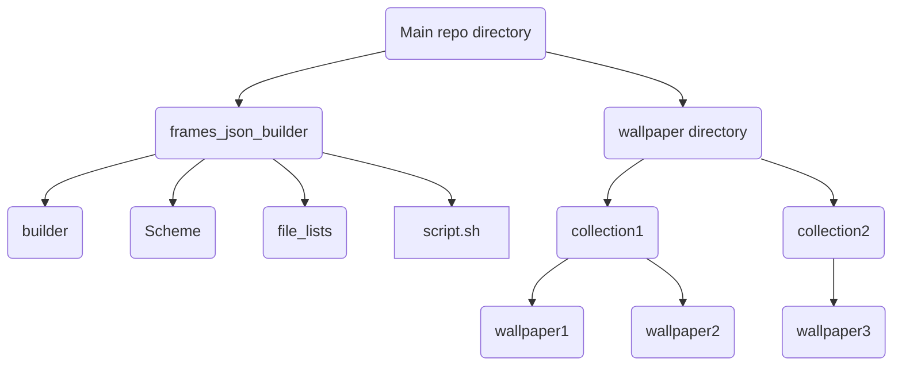

# Frames_Json_Builder
Json file builder for [Jahir Fiquitiva's](https://github.com/jahirfiquitiva) [Frames Dashboard](https://github.com/jahirfiquitiva/Frames)
This tool could help you create json file from wallpaper folders.

## Installation

#### Dependencies

##### Windows
There is currently no native script for windows. But you can use the script with [WSL](https://ubuntu.com/tutorials/install-ubuntu-on-wsl2-on-windows-10#2-install-wsl). (Install Ubuntu 22.04 for install exa without problem.)
```bash
sudo apt-get install nano sed exa
```

##### Ubuntu
```bash
sudo apt-get install nano sed exa
```

Download code and extract archive to main wallpaper folder. It should look like the following.



## Usage
Run script.sh
#### First configuration
The first time you run the script, it will check the configuration file and create it because it can't find it.
You must fill in the variables on the screen that opens.
```bash
ROOT=destination of root directory of wallpapers
USERNAME=github username
REPO=github repository name
WALLFOLDER=parent directory name of the collections
```
After fill the variables press ctrl+x and save configuration file. Wait for the script finishes. Then your wallpapers.json file will be in root folder.


#### Naming scheme
- All words must begin with a capital letter.
- Use underscores instead of spaces.
- There should be no spaces between numbers and words.
- Filenames should be in the form of "Artist_Name-Wallpaper_Name.png" (The type of extension doesn't matter.)
- For example "Osman_Onur_KOÇ-Material_You_Wp1.png"
## Help
#### How to change Configuration file
Just delete config.cfg from file_lists directory. After run script it recreate new config file.
#### I'm having trouble creating the configuration file
[Nano Shortcuts](https://nano-editor.org/dist/latest/cheatsheet.html) for how to use text editor while creating configuration file.
#### How to change type of wallpaper license.
Edit license line in ./Frames_Json_Builder/Scheme/Scheme.json file.
### License
This source code is provided under the GPLv3 license. Script includes third party packages provided under other open source licenses, please see [LICENSE](https://github.com/osmanonurkoc/Frames_Json_Builder/blob/main/LICENSE) for additional details.
